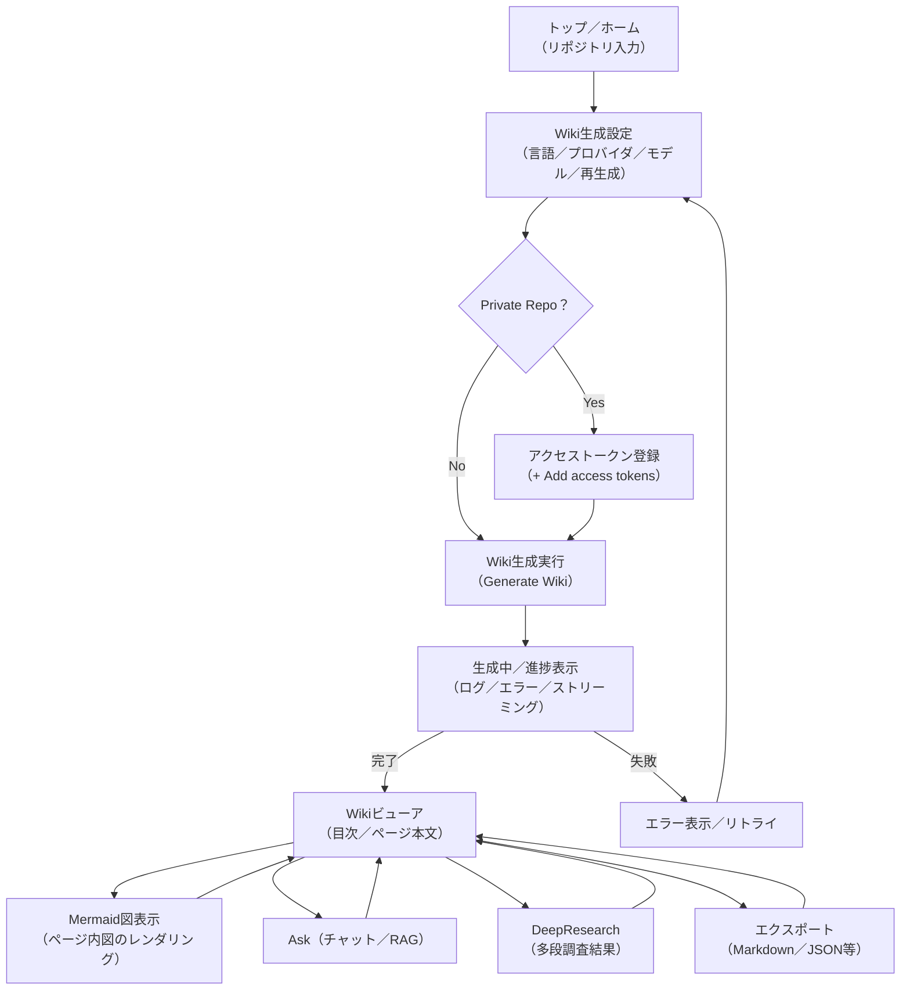

# 画面遷移図

```mermaid
flowchart TD
  A["トップ／ホーム\n（リポジトリ入力）"] --> B["Wiki生成設定\n（言語／プロバイダ／モデル／再生成）"]
  B --> C{"Private Repo？"}
  C -->|Yes| D["アクセストークン登録\n（+ Add access tokens）"]
  C -->|No| E["Wiki生成実行\n（Generate Wiki）"]
  D --> E

  E --> F["生成中／進捗表示\n（ログ／エラー／ストリーミング）"]
  F -->|完了| G["Wikiビューア\n（目次／ページ本文）"]
  F -->|失敗| H["エラー表示／リトライ"]

  G --> I["Mermaid図表示\n（ページ内図のレンダリング）"]
  G --> J["Ask（チャット／RAG）"]
  G --> K["DeepResearch\n（多段調査結果）"]
  G --> L["エクスポート\n（Markdown／JSON等）"]

  I --> G
  J --> G
  K --> G
  L --> G
  H --> B
```